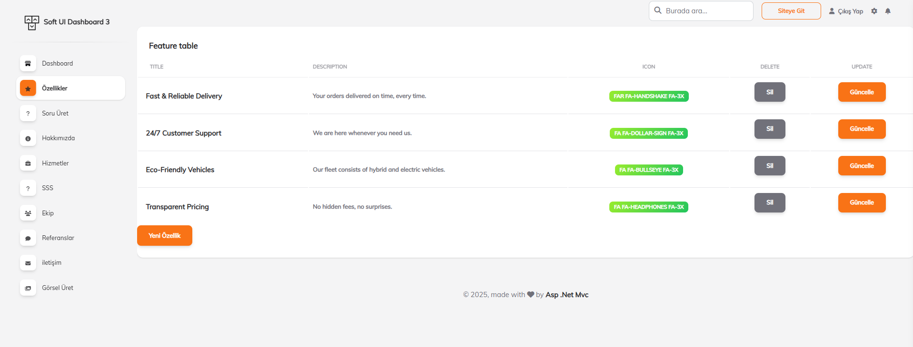
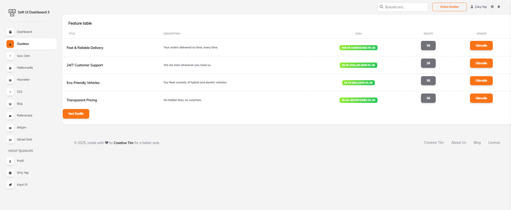
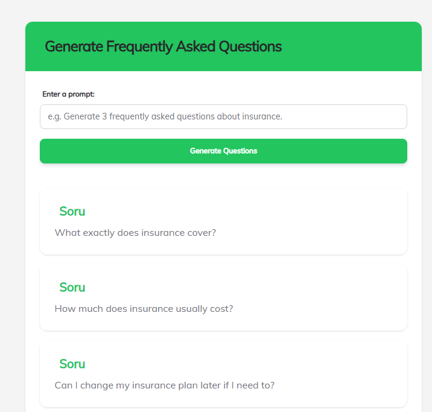
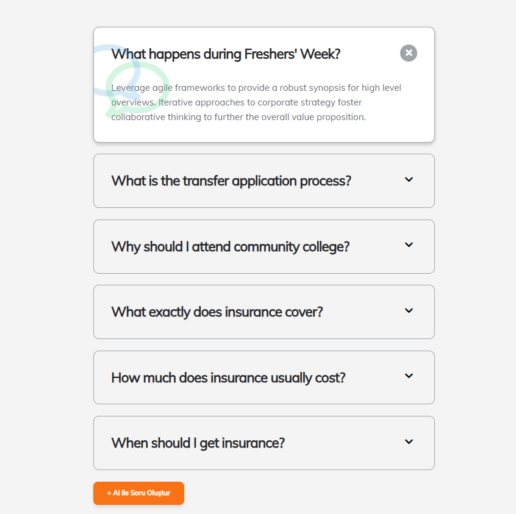
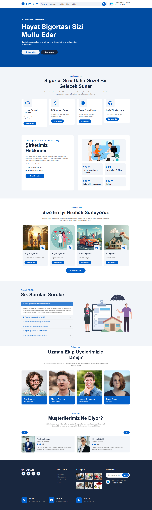
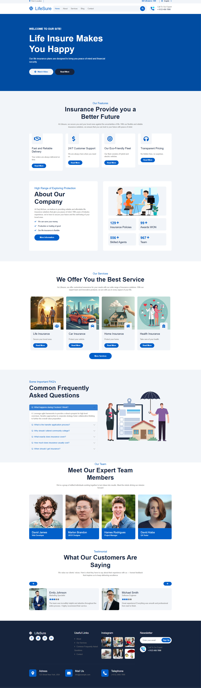
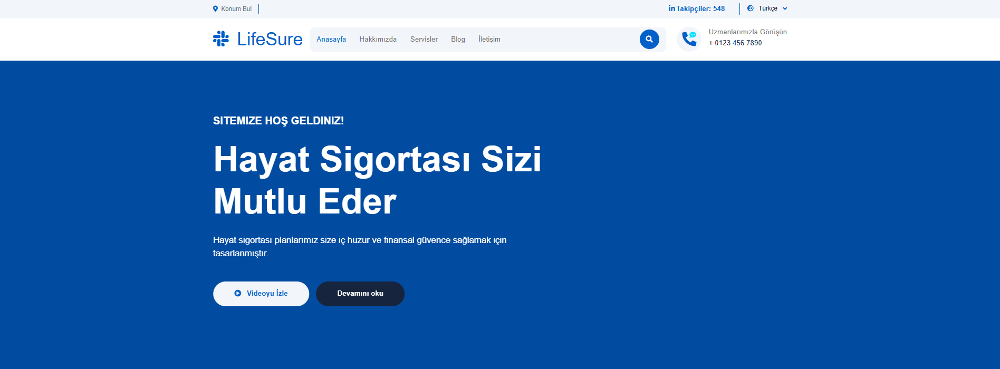

# 🌟 AI Destekli Çok Dilli Kurumsal Web Platformu

Bu proje, yapay zeka ile güçlendirilmiş, çok dilli destek sunan, dinamik içerik yönetimine sahip bir kurumsal web çözümüdür. AI servisleri ve sosyal medya entegrasyonları ile zenginleştirilmiş mimarisi sayesinde hem kullanıcı dostu hem de yönetici odaklı bir yapı sunar.

---

## 🚧 Proje Hakkında

Bu platform, kurumsal ihtiyaçlara yönelik olarak geliştirilmiş; görsel ve metinsel içerikleri yapay zeka aracılığıyla üretebilen, yönetilebilir ve çok dilli destekli bir web altyapısıdır. 

> Kullanıcılar içerik girerek görsel üretebilir, admin panelden dinamik veri girişi sağlayabilir ve sistem çok dilli içerikleri otomatik yönlendirme ve kaynak dosyaları ile sunar.

---

## 🛠️ Kullanılan Teknolojiler ve Araçlar

| Teknoloji / Araç | Açıklama |
|------------------|----------|
| **ASP.NET MVC 5** | Katmanlı mimari ile geliştirilmiş web yapısı |
| **Entity Framework (DbFirst)** | Mevcut veritabanı üzerinden güçlü modelleme |
| **Hugging Face API** | Yapay zeka ile görsel ve içerik üretimi |
| **LinkedIn API** | Sosyal medya verilerinin canlı çekimi |
| **.resx Resource Files** | Türkçe & Fransızca içerik yönetimi |
| **Özel Routing + Content Tables** | İngilizce için sayfa bazlı esnek dil yönetimi |
| **Bootstrap 5 + FontAwesome** | Modern ve mobil uyumlu kullanıcı arayüzü |
| **Razor View Engine** | Dinamik sayfa render işlemleri |

---

## 🤖 Yapay Zeka Entegrasyonları

- 🧠 **FAQ (Sık Sorulan Sorular)** üretimi: Prompt bazlı otomatik içerik oluşturma
- 🖼️ **Görsel üretimi**: Kullanıcı girdisinden AI ile görsel yaratımı
- 📊 **Sosyal Medya verisi**: LinkedIn üzerinden veri çekimi ve görselleştirme

---

## 🌍 Çok Dilli Mimari

- **Türkçe & Fransızca**:  
  `.resx` dosyaları ile klasik kaynak dosya yönetimi, `Global.asax` üzerinden kültür ayarı  
- **İngilizce**:  
  `/en/*` URL segmentleri ile özel yönlendirme ve içerik tabloları üzerinden sayfa bazlı kontrol  
  > İngilizce içerikler admin panelden ayrı ayrı tablo yapıları ile yönetilebilmektedir.

---

## 🎯 Admin Panel Yetkinlikleri

- 🔐 Rol bazlı erişim yapısı
- 📝 Sayfa içeriklerini CRUD işlemleri ile yönetebilme
- 🌐 Çok dilli sayfa içerik ekleme desteği
- 📁 Görsel yönetimi, AI prompt kayıtları, loglama vb.

---

## 🧠 Bu Projeden Öğrendiklerim

- ✅ API & AI entegrasyonlarını gerçek senaryolarda uygulama
- ✅ Dinamik ve çok dilli sistem kurulumunda profesyonel yapı oluşturma
- ✅ Clean code prensiplerine uygun modüler yapı kurma
- ✅ Katmanlı mimari ve `DbFirst` ile kurumsal proje geliştirme deneyimi

---

> 🎓 Teorik bilginin pratiğe dönüştüğü, yapay zeka ve yazılım mimarisiyle zenginleştirilmiş gerçek bir proje deneyimi oldu.

---

## 🖼️ Uygulama Ekran Görüntüleri

### 🔐 Admin Panel Özellikleri

### 📊 Yönetim Dashboard

### ❓ SSS Üretimi (AI Tabanlı)

### 📃 SSS Listeleme Ekranı

### 🌍 Kullanıcı Arayüzü – Türkçe

### 🌐 Kullanıcı Arayüzü – İngilizce

### 🎨 Prompt'tan Görsele (1)

### 🧠 Prompt'tan Görsele (2)

### 🔗 LinkedIn Takipçi Verisi – Türkçe

